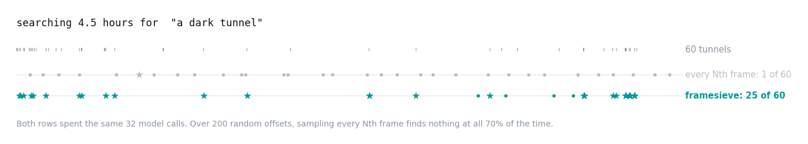

<picture>
  <source media="(prefers-color-scheme: dark)" srcset="figures/banner.dark.png">
  
</picture>

<p align="center">
  <a href="https://pypi.org/project/framesieve/"></a>
  <a href="https://pypi.org/project/framesieve/"></a>
  <a href="https://github.com/AyushExel/framesieve/actions/workflows/ci.yml"></a>
  <a href="LICENSE"></a>
</p>

---

**Find things in video by describing them.**

You have hours of footage — security cameras, dashcams, drone survey, recorded
meetings, gameplay — and you want the bit where the red car pulls in. Watching it
is not an option. Running a vision model over every frame is 86,400 calls per day
of video, so that is not an option either.

framesieve indexes the video **once**, in about 15 seconds per hour, and then
finds things in it in about **6 milliseconds**.

```bash
pip install framesieve

framesieve index  my_video.mp4
framesieve search my_video.mp4 "a red car pulling in"
```

**No GPU required.** Indexing an hour of video takes a minute or two on a
laptop CPU instead of fifteen seconds on a GPU, and a search is ~110 ms instead
of ~6 ms — still interactive.

<picture>
  <source media="(prefers-color-scheme: dark)" srcset="figures/at_a_glance.dark.png">
  
</picture>

## Try it

```console
$ framesieve index cabride.mp4
indexing cabride.mp4
  encoder google/siglip2-base-patch16-224 @ 75de2d55ec2d, 1.0 fps
  wrote cabride.framesieve-siglip2-base-224-1fps.lance  (50.0 MB, 11.1 MB per hour)
  2.7 min for 4.51 h of video = 105x realtime

$ framesieve search cabride.mp4 "a dark tunnel" -k 16

query    : 'a dark tunnel'
video    : cabride.mp4
index    : 16,244 frames, 4.51 h, siglip2-base-224
strategy : segment_adaptive, 16 candidates (0.10% of frames)
timing   : select 141.2 ms, fetch 0.31 s, vlm 0.70 s

16 hit(s) above threshold 0.0:
          time    hh:mm:ss     vlm score   similarity
         104.0     0:01:44          9.75        0.163
        1585.0     0:26:25          9.62        0.149
        4567.0     1:16:07          9.50        0.165
       13837.0     3:50:37          9.50        0.151
       14860.0     4:07:40          9.50        0.152
        5628.0     1:33:48          9.37        0.155
        9750.0     2:42:30          9.37        0.150
       14553.0     4:02:33          9.25        0.158
```

Every one of those sixteen candidates came back confirmed. `select` includes
loading the text encoder, which happens once per process — in a long-running
program a query costs about 6 ms.

Add `--save-frames hits/` to write the matching frames out as JPEGs.

## In Python

```python
import framesieve as fs

video = fs.open("my_video.mp4")            # indexes if needed, loads if not

for hit in video.search("a red car", k=8):
    print(hit.timecode, hit.score)         # 0:14:22  0.183
```

By default a hit means *looks similar*. Pass `confirm=True` and a vision-language
model actually looks at each candidate and tells you yes or no:

```python
hits = video.search("a red car", k=8, confirm=True)

for hit in hits.above(0.0):                # only what the model confirmed
    print(hit.timecode, hit.vlm_score)

frames = video.frames(hits[:4])            # the pixels, as uint8 arrays
curve  = video.score("a red car")          # similarity for every frame
```

`import framesieve` takes about 50 ms and does not import torch. Building an
index needs torch; *reading* one does not, so you can ship indexes to machines
with no GPU and search them there.

### Searching a whole library

Everything above holds one video's vectors in memory, which is right up to a few
hundred hours. Past that — or as soon as you want to search *across* recordings
rather than within one — switch to a `Collection`, which is the same vectors in
[LanceDB](https://lancedb.com) on disk.

| footage | vectors | as a numpy array | |
|---|---|---|---|
| 100 hours | 360,000 | 1.1 GB | stay on `fs.open()` |
| **500 hours** | 1.8M | **5.5 GB** | around here, switch |
| 10,000 hours | 36M | 110 GB | `Collection`, or nothing |

You do not re-encode anything to switch: a collection is built by merging the
sidecars you already have.

```python
lib = fs.Collection("footage.lancedb")

lib.add("cam1.mp4")                      # index and append
lib.add_indexes("indexes/*.lance")       # or merge indexes built elsewhere
lib.build_ann()                          # once, after the bulk load

for hit in lib.search("a red car", k=20):
    print(hit.video, hit.timecode, hit.score)
```

Measured on **10 million vectors** — 2,778 video-hours, 62 GB of vectors and
index on disk:

| | |
|---|---|
| open the collection | 0.18 GB resident |
| search | **112 ms** median, 139 ms p90 |
| peak memory | 5.5 GB — runs under an 8 GB cap, OOM-killed at 4 GB |
| the same vectors in numpy | 31 GB resident, always |

Not constant memory — graph traversal has a real working set — but about 6×
less than holding the corpus, which is the difference between a 2,778-hour
library running on a laptop and not running at all.

On a 205-hour corpus of genuinely distinct video, the measure that matters is
whether the **top hit** matches an exact scan — 15 queries, exact scan as the
answer key:

| index | size | top hit correct | latency |
|---|---|---|---|
| **IvfHnswFlat** (default) | 2.3 GB | **15/15** | 10 ms |
| IvfFlat | 2.3 GB | 9/15 | 16 ms |
| IvfFlat, `nprobes=400` | 2.3 GB | 15/15 | 81 ms |
| exact scan | — | 15/15 | 133 ms |

IVF only matches the graph by probing half its partitions, for 8× the latency —
partition scanning grows with `nprobes` and graph traversal does not.

One warning worth having: the **quantized index types do not work** on these
embeddings. The best similarity across 205 hours is 0.16 and neighbours differ
in the third decimal, so quantization error swamps the signal being ranked.
`IvfPq` scores **0%** recall@20 and `IvfRq` 24%, at every probe count and with
refinement. Use `Collection.recall_at(queries)` to check where your own corpus
lands.

```bash
pip install "framesieve[collection]"
python examples/04_search_a_whole_corpus.py ./footage "a red car"
```

The two compose, and that is the usual shape: search the library to find *which*
recording, then use the per-video index to spend expensive-model calls inside it.

```python
hit   = lib.search("a red car", k=5, per_video=1)[0]     # which recording
video = fs.open(hit.video)                               # then work inside it
best  = video.search("a red car", k=32, confirm=True)    # with the VLM
```

Full guide, including where the threshold is and which index type to use:
**[Scaling to a library](docs/scaling.md)**.

### Running on CPU

Everything picks CUDA if there is one, Apple silicon if there is one, and CPU
otherwise — no flags, no configuration. The retrieval encoder is 93M parameters,
small enough that CPU is a real option rather than a degraded mode:

| | index 1 hour of video | search |
|---|---|---|
| GPU (GH200) | 15 s | 6 ms |
| CPU (64 cores) | 1 min | 110 ms |

Ranking is the same either way — a matrix multiply against an index that already
exists, 0.03 ms for a 4.5-hour video. The difference is encoding your query
text, which is a model forward pass: about 1 ms on a GPU and 100 ms on a CPU.
Still interactive, just not instant. The one part that really wants a GPU is
`confirm=True`, which runs a 7B vision-language model.

**[Quickstart](docs/quickstart.md)** ·
**[API reference](docs/api.md)** ·
**[How it works](docs/how-it-works.md)** ·
**[Scaling to a library](docs/scaling.md)** ·
**[Examples](examples/)**

## What it's for

Good fits:

- **Long recordings where the interesting part is a small fraction.** Security
  and dashcam archives, field recordings, sports, lecture and meeting capture.
- **Repeated questions about the same footage.** Indexing is paid once; every
  query after that is a matrix multiply, so the tenth search is free.
- **Building something on top.** The Python API gives you timestamps, scores, a
  similarity curve over the whole video, and the frames themselves.

Does not work today:

- **Reading text in the video.** No OCR. Signs, licence plates and captions are
  close to invisible to it.
- **Where something is in the frame.** "the cup on the left" does not work — it
  matches whole frames, not regions.
- **Anything you can hear.** No audio, no speech.

Not what it is for, and not planned:

- **Summarising a whole video.** It finds *where*, not *what happened overall*.
  Measured: on whole-video questions, which frames you pick stops mattering and
  only how many you pick does.

### Wanted

The first three above are additions, not redesigns, and the pieces are separable
enough that they are good first contributions:

- **Audio.** A speech transcript indexed alongside the frames would cover a large
  share of what people actually ask recordings.
- **OCR.** A text-detection pass over the candidate frames, after retrieval
  narrows them down — which is the whole point of the cascade.
- **Region-level matching**, for "on the left" style queries.

Open an issue if you want to take one on.

## How it works

```
video ──► sample 1 frame/sec ──► small image encoder ──► index (11 MB per hour)
                                                            │
query ──► encode text ──────────► rank every frame ─────────┘
                                        │
                                        └──► optional: show the top K to a VLM
```

Two stages, and the reason for them is cost. A vision-language model costs about
**809× more per frame** than the small encoder, measured on the same GPU. So the
small one looks at everything, once, and the expensive one looks only at the
handful of frames that survived.

That is also why the index is worth building: the cheap pass runs once per
*video*, the expensive pass runs once per *query*.

**Choosing `k`** — it is how many candidates you consider, and with `confirm` how
many model calls you spend. Higher finds more and costs more; there is no value
at which you are finished. Start at 32.

## How good is it

On [MomentSeeker](https://arxiv.org/abs/2502.12558), a public benchmark for
finding moments in long video, framesieve beats the published results while
indexing 14× cheaper:

| | R@1 | mAP@5 | index cost, GPU-s per hour |
|---|---|---|---|
| LanguageBind (404M params) | 18.2 | 25.4 | 2.45 |
| InternVideo2 (1B params) | 19.7 | 26.6 | 5.17 |
| **framesieve** (93M params, no VLM) | **20.10** | 28.06 | **0.37** |
| **framesieve + 10 VLM calls** | **23.40** | **30.85** | **0.37** |

Against a 4.5-hour video with every frame checked by a model, framesieve finds
**26× more** of what you asked for than sampling every Nth frame does, at the
same cost. Searching that video for `"a dark tunnel"` with a budget of 32 model
calls:

<picture>
  <source media="(prefers-color-scheme: dark)" srcset="figures/coverage.dark.png">
  
</picture>

Both spent the same 32 calls. Over 200 random offsets, sampling every Nth frame
finds nothing at all 70% of the time.

The measurements behind all of this, and the several approaches that did not
work: **[the write-up](https://batchnorm.com)**.

## Limits worth knowing

- **It samples one frame per second by default.** Something visible for less than
  a second can be missed. `--fps 2` doubles the sampling and the index cost.
- **h.264 works best.** HEVC and AV1 decode meaningfully slower.
- **Timings here are from one machine** (a GH200, 64 cores). The ratios should
  hold elsewhere; the absolute numbers will not.
- **Describe, don't ask.** `"a dark tunnel"` works well; `"is the train in a
  tunnel?"` works measurably worse. The retrieval model was trained on captions.

## Install

```bash
# torch first, from the index for your platform — installing it as a transitive
# dependency is the usual way to end up on a CPU-only wheel, which is silent and
# about 30x slower
pip install torch --index-url https://download.pytorch.org/whl/cu128

pip install framesieve
```

Also needs `ffmpeg` on your `PATH`.

| extra | what it adds |
|---|---|
| `framesieve[vlm]` | `confirm=True`: fetch frames and check them with a vision-language model |
| `framesieve[store]` | no-op alias; the frame store needs nothing extra now |
| `framesieve[dev]` | pytest, ruff |

### Keeping the frames too

`--store` writes every sampled frame as a JPEG next to its embedding, in a
[Lance](https://lancedb.github.io/lance/) dataset. Measured on the same clip:

| | plain index | `--store` |
|---|---|---|
| disk | 11 MB per hour | **2711 MB per hour** (0.3× the video) |
| indexing throughput | 222× realtime | 104× realtime |
| fetching a frame | 14.5 ms | **0.9 ms** |
| needs the video file afterwards | yes | **no** |

It is off by default because the disk is 55× and most of it buys nothing: search
never touches pixels, and even with `confirm` the model itself dominates — a
32-call search goes from about 1.4 s to 1.0 s, not 15× faster.

Turn it on when you confirm a lot, or when you want the index to be
self-contained and the source video to go somewhere cheap.

```bash
pip install "framesieve[store]"
framesieve index my_video.mp4 --store
```

Search picks up the store automatically if one is there.

## Contributing

Bug reports, benchmarks on your own footage, and new encoder or VLM backends are
all welcome — see [CONTRIBUTING.md](CONTRIBUTING.md). Tests that need a GPU, a
model download or a video file skip themselves, so CI stays green on CPU and a
red build means a real bug.

```bash
pip install -e ".[dev]"
pytest -q && ruff check .
```

## License

[Apache-2.0](LICENSE). The test video is from the Internet Archive; the
benchmarks are the property of their authors and carry their own terms.
