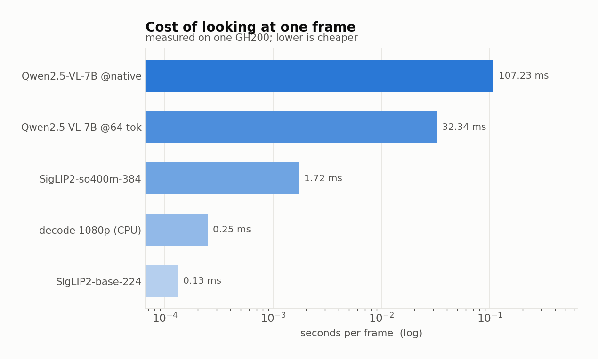
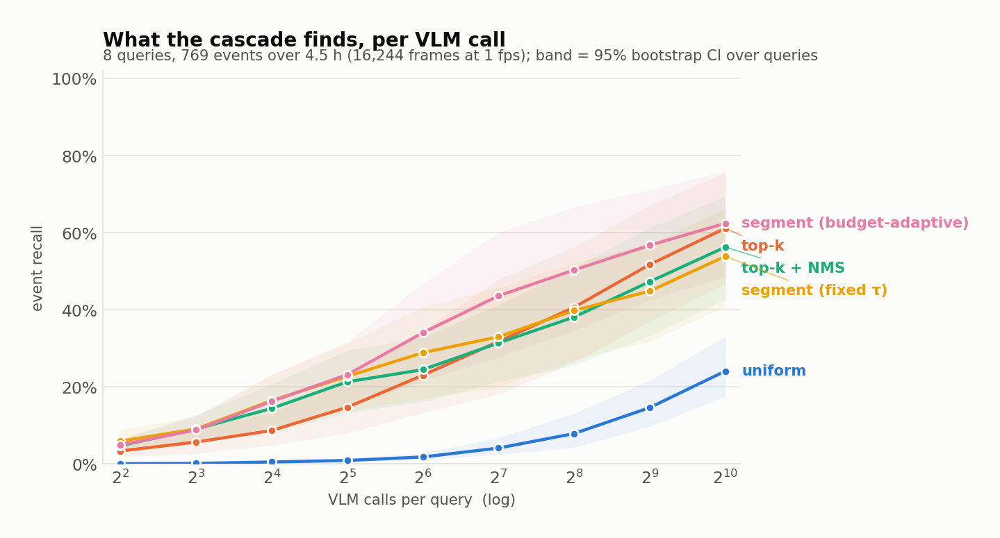
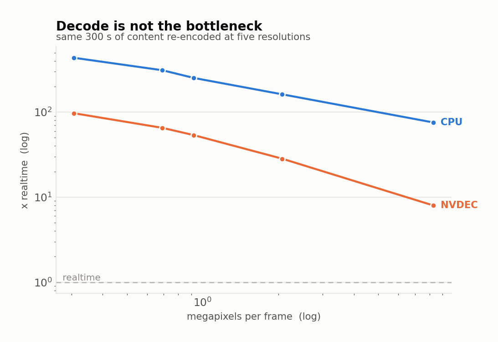
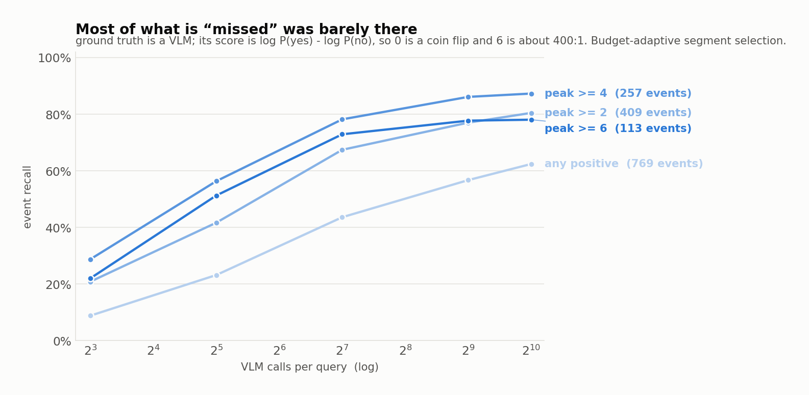

<picture>
  <source media="(prefers-color-scheme: dark)" srcset="figures/banner.dark.png">
  
</picture>

<p align="center">
  <a href="https://pypi.org/project/framesieve/"></a>
  <a href="https://pypi.org/project/framesieve/"></a>
  <a href="https://github.com/AyushExel/framesieve/actions/workflows/ci.yml"></a>
  <a href="LICENSE"></a>
</p>

---

You have hours of footage and a question about it. At one frame per second, a
single day of video is 86,400 frames — about **2.6 GPU-hours of vision-language
model for one question**. So nobody does it. They sample every tenth frame and
quietly miss things.

framesieve indexes the video **once** with a small image encoder, then answers
every query after that with a matrix multiply — spending the expensive model
only on the handful of frames that survive.

```bash
pip install framesieve

framesieve index  my_video.mp4
framesieve search my_video.mp4 "a dark tunnel"
```

<picture>
  <source media="(prefers-color-scheme: dark)" srcset="figures/at_a_glance.dark.png">
  
</picture>

## What it looks like

```console
$ framesieve search cabride.mp4 "a dark tunnel" -k 16

query    : 'a dark tunnel'
index    : 16,244 frames, 4.51 h, siglip2-base-224
strategy : segment_adaptive, 16 candidates (0.10% of frames)
timing   : select 1.5 ms, fetch 0.19 s, vlm 0.24 s

7 hit(s) above threshold 0.0:
          time    hh:mm:ss     vlm score   similarity
        4821.0     1:20:21          8.50        0.147
        4822.0     1:20:22          7.88        0.146
       13853.0     3:50:53          6.12        0.139
       14877.0     4:07:57          5.75        0.141
```

The **vlm score** is a log-odds margin — 0 is a coin flip, +2 is about 7:1 for
yes. The **similarity** is retrieval, and is only comparable within one query.

```python
import framesieve as fs

video = fs.open("my_video.mp4")           # indexes if needed, loads if not

for hit in video.search("a dark tunnel", k=8):
    print(hit.timecode, hit.score)

hits = video.search("a dark tunnel", k=8, confirm=True)   # ask a real model
for hit in hits.above(0.0):
    print(hit.timecode, hit.vlm_score)

curve  = video.score("a dark tunnel")     # similarity for every frame
frames = video.frames(hits[:4])           # the actual pixels, uint8 HWC
```

`import framesieve` costs about 50 ms and does **not** import torch. Building an
index needs torch; *reading* one does not, so you can query and inspect indexes
on a machine with no GPU stack at all.

**[Quickstart](docs/quickstart.md)** ·
**[API reference](docs/api.md)** ·
**[How it works](docs/how-it-works.md)** ·
**[Examples](examples/)** ·
**[The write-up](https://batchnorm.com)**

## Why it works

The expensive model costs **809× the cheap one per frame**, measured on the same
hardware. That ratio is the whole design: at 809× you cannot look at everything,
so the only question left is which frames you look at.

<picture>
  <source media="(prefers-color-scheme: dark)" srcset="figures/cost_hierarchy.dark.png">
  
</picture>

The cheap pass runs **once per video**. The expensive pass runs **once per
query**. That asymmetry, not the ratio, is what makes an index worth building.

### Against the default

Uniform sampling is what everyone actually does, and it is stronger than people
expect — unbiased, no index, no query-dependent failure mode. It is also exactly
analysable: an event of length `L` in `N` frames is found with probability
`min(1, K·L/N)`. Invert that and reaching 50% event recall on this video needs
**2,839 model calls**; 90% needs **12,866**, which is 79% of the frames.

<picture>
  <source media="(prefers-color-scheme: dark)" srcset="figures/recall_curve.dark.png">
  
</picture>

At 32 model calls the cascade finds **26×** as many events. Uniform needs 1,024
calls to reach what the cascade reaches at 33. Bands are 95% bootstrap intervals
over queries, against dense per-frame VLM ground truth: **129,952 scores over a
4.5-hour video**, 5.4 GPU-hours of it.

### And decode is not the bottleneck

The usual assumption is that reading the frames is what costs you. Measured, it
is off by 30–70×:

<picture>
  <source media="(prefers-color-scheme: dark)" srcset="figures/decode_scaling.dark.png">
  
</picture>

4K decodes at **75× realtime** on CPU — a day of 4K in 19 minutes. GPU decode is
*slower* in wall clock here; its advantage is costing 0.5 CPU cores instead of
16. See [METHOD.md](docs/METHOD.md) for the traps, including NVDEC missing from a
driver install and failing silently.

## Benchmarks

**On MomentSeeker this passes the published retrieval frontier**: R@1 **20.10**
from a 93M-parameter image encoder alone with zero VLM calls, while indexing
**14× cheaper** in GPU time than InternVideo2.

| | R@1 | mAP@5 | index, GPU-s per h of video | query latency |
|---|---|---|---|---|
| LanguageBind (404M) | 18.2 | 25.4 | 2.45 | ~1 ms |
| InternVideo2 (953M, reconstructed) | 19.7 | 26.6 | 5.17 | ~1 ms |
| framesieve, cheap stage, `max` pooling (93M) | 17.50 | 26.36 | **0.37** | 1.1 ms |
| **framesieve, cheap stage, top-4 pooling** | **20.10** | 28.06 | **0.37** | **1.5 ms** |
| **framesieve + 5 clip calls** | 22.50 | 29.39 | **0.37** | 1.07 s |
| **framesieve + 10 clip calls** | **23.40** | **30.85** | **0.37** | 2.13 s |

The jump from 17.50 to 20.10 is one line — how the frames in a candidate segment
become a single score — and nothing else: no extra compute, no larger model.
That change turned out not to be about video at all, which became a separate
piece: **[The pooling function nobody tunes](https://batchnorm.com)**, and the
standalone `src/framesieve/pooling.py` it produced.

## Two findings that matter more than the speedup

- **Top-k already saturates the ceiling its ranking allows**, to within 0.2
  points at every budget. Diversity-aware selection adds up to 11.7 points in
  the middle of the budget range and nothing at either end. A 4.6× bigger
  encoder adds nothing at all.
- **Most of what the retriever appears to miss was never clearly there.**
  Stratifying recall by the oracle's own confidence turns 62% into **87%**. The
  events it never surfaces have a median oracle score of 1.00 and a median
  length of 1 second.

<picture>
  <source media="(prefers-color-scheme: dark)" srcset="figures/confidence.dark.png">
  
</picture>

## Install

```bash
# torch first, from the index for YOUR platform. Installing it as a transitive
# dependency is the most common way to end up on a CPU-only wheel — silent, and
# about 30x slower.
pip install torch --index-url https://download.pytorch.org/whl/cu128

pip install framesieve          # or, from a clone:  pip install -e .
```

Also needs `ffmpeg` with h.264 support on your `PATH`.

| extra | what it adds |
|---|---|
| `framesieve[vlm]` | the confirm stage: fetch frames and score them with a vision-language model |
| `framesieve[store]` | Lance frame store: frames kept as JPEG blobs, **~14× faster** frame fetch for ~0.3× the video in disk |
| `framesieve[dev]` | pytest, ruff, matplotlib |

For GPU decode you also need the driver's video library — if
`ldconfig -p | grep nvcuvid` is empty, install
`libnvidia-decode-<your-driver-version>`; without it every NVDEC path fails and
silently falls back to software.

## How it works

```
video ──► decode @1fps ──► SigLIP2 every frame ──► collapse redundancy
                                   │                       │
                                   └──── embeddings ───────┤
                                                           ▼
query ──► SigLIP2 text ──► rank ──► pick K ──► Qwen2.5-VL ──► answer
```

Five selection strategies share one interface, so an ablation is a change of one
string rather than a change of pipeline:

| strategy | what it does |
|---|---|
| `uniform` | evenly spaced in time, random phase — the baseline, and stronger than people expect |
| `topk` | highest-scoring frames — on real video, often k near-copies of one moment |
| `nms` | top-k with temporal suppression, window adapted to the budget |
| `segment` | top-k over redundancy-collapsed segments fixed at index time |
| `segment_adaptive` | segments cut per query, `8 × budget` of them (default, and the best on our ground truth) |

## Reproduce the experiments

```bash
./scripts/fetch_data.sh cabride         # 4.5 h test video, 4.1 GB
.venv/bin/python scripts/verify.py      # 13 checks: env, decode paths, determinism

# baseline (a): dense VLM over every frame — the quality ceiling and its true cost
.venv/bin/python scripts/build_groundtruth.py

# the headline: recall vs compute, all strategies, with error bars
.venv/bin/python scripts/eval_recall_curve.py

# which component did the work
.venv/bin/python scripts/ablate.py

# derivations and the analyses behind the post
.venv/bin/python scripts/analysis.py

# the pooling result: synthetic, ColBERT on BEIR, plain RAG, and the metric test
.venv/bin/python scripts/how_many_match.py
.venv/bin/python scripts/late_interaction.py --dataset scifact
.venv/bin/python scripts/rag_pooling.py --dataset nfcorpus
.venv/bin/python scripts/metric_hides_it.py
.venv/bin/python scripts/measure_m.py          # m measured by a dense oracle
.venv/bin/python scripts/measure_m_ms.py       # and on a second dataset

# the standard benchmarks
./scripts/fetch_data.sh videomme
.venv/bin/python scripts/index_videomme.py
.venv/bin/python scripts/eval_videomme.py

./scripts/fetch_data.sh momentseeker
.venv/bin/python scripts/eval_momentseeker.py --vlm-budgets 0 5 --rerank-frames 4

# regenerate every figure from runs/
.venv/bin/python scripts/make_figures.py
```

The two published baselines are timed in a **separate** environment, because
`languagebind` pins `transformers<5` and installing it alongside the main venv
silently downgrades it:

```bash
python3 -m venv .venv-baselines
.venv-baselines/bin/pip install --index-url https://download.pytorch.org/whl/cu128 \
    torch==2.7.0 torchvision==0.22.0 torchaudio==2.7.0
.venv-baselines/bin/pip install languagebind opencv-python-headless pytorchvideo timm
.venv-baselines/bin/python bench/baseline_throughput.py --which languagebind internvideo2
```

`scripts/verify.py` is worth running first. It checks the things that, if wrong,
would silently corrupt a result rather than crash — including that the index and
the refine stage return **the same image** for the same timestamp. That was false
for the first day of this project; see `docs/METHOD.md`.

## Layout

```
framesieve              run the CLI from a clone without installing
src/framesieve/
  api.py                the public API: open/index/load -> VideoIndex
  cli.py                the `framesieve` command: index / search / info
  frames.py             streaming decode at a target rate, with true PTS
  fetch.py              random access by timestamp (parallel ffmpeg seeks)
  store.py              Lance blob store: frames as byte ranges, 0.98 ms/frame
  videoblob.py          the other design: store the video, read GOP ranges
  encoders.py           SigLIP2, pinned revisions
  vlm.py                Qwen2.5-VL as a yes/no scorer and an MCQ answerer
  index.py              the dense index and redundancy collapse
  search.py             the five selection strategies
  evaluate.py           events, event recall, bootstrap CIs
  figures.py            the write-ups' figures, light and dark
  pooling.py            score pooling: topk_mean and the k calibration.
                        numpy only, imports nothing else here, and the subject
                        of the pooling write-up. Copy the file if that is
                        easier than depending on it
bench/                  decode, encoder, VLM, frame-access, palette benchmarks
scripts/                ground truth, evaluation, ablations, verification
  benchmarks/           Video-MME and MomentSeeker under their own protocols
scripts/analysis.py     the derivations, and whether measurement agrees with them
scripts/make_readme_assets.py   the banner and the number strip, from runs/
examples/               three runnable scripts
tests/                  test_api.py is the public contract; test_core.py the algorithms
docs/                   quickstart, API reference, how it works, method notes
docs/METHOD.md          what is measured and which decisions could have gone otherwise
docs/frame-access.md    three ways to get frames back, with numbers
```

## Honest limits

- **1 fps sampling.** Events shorter than a second can be missed by every method
  here, including the ground truth. It is a knob, not a limit — the cost model is
  linear in it — but the numbers quoted are at 1 fps.
- **h264 only.** HEVC and AV1 decode meaningfully slower on CPU.
- **One GPU, one architecture.** Everything is measured on a GH200. The *ratios*
  should travel; the absolute numbers will not.
- **The cheap stage is a caption model.** It is handed captions, not the VLM's
  yes/no questions, because feeding SigLIP a question handicaps retrieval for
  reasons unrelated to selection. On a benchmark whose queries are questions,
  that adaptation is not available, and it costs.
- **The benchmark is a checkpoint, not the objective.** Video-MME long videos are
  30–60 min, 24–48× shorter than the regime this is built for, and many of its
  questions are global ones where frame selection cannot help.

## Prior work

Qin et al., *Efficient Frame Selection for Long Video Understanding via
Reinforcement Learning*, CVPR 2026 — a learned selector, evaluated on
LongVideoBench / VideoMME / EgoSchema / MLVU at K=8 frames. Their Table 2 is the
useful reference point:

```
Random 49.7    Uniform 51.1    CLIP-TopK 55.7    AKS 55.9    RL selector 56.5
```

A frozen CLIP top-k baseline gets within **0.8 points** of the learned selector.
framesieve is in that family, so the realistic goal is cost at matched accuracy,
not beating the frontier on accuracy.

## Contributing

Bug reports, benchmarks on your own footage, and new encoder or VLM backends are
all welcome — see [CONTRIBUTING.md](CONTRIBUTING.md). Tests that need a GPU, a
model download or a video file skip themselves, so CI stays green on CPU and a
red build means a real bug.

```bash
pip install -e ".[dev]"
pytest -q && ruff check .
```

## License

Code is [Apache-2.0](LICENSE). The test video is from the Internet Archive; the
benchmarks are the property of their authors and carry their own terms.
